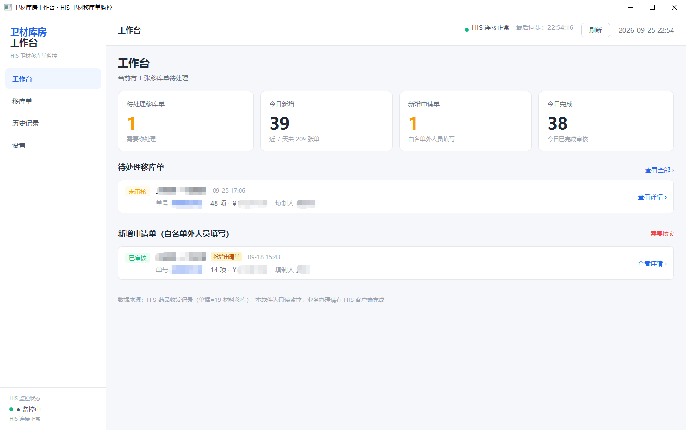

<div align="center">

# 医院软件桌面 UI 设计技能

**Medical Desktop UI Design — 让 AI 编码助手按医院工作台规范设计界面的 DSH 技能**

把《医院软件桌面端 UI 设计规范》固化成可自动调用的技能：新增页面、新增/改动功能、调整布局、加字段、改样式时，
自动套用同一套医疗工作台设计系统，而不是每次重新描述颜色、布局、卡片、表格与状态。

[](#许可证)
[](#覆盖范围)
[](#核心特性)

**仓库地址：<https://github.com/vladimirzz487/dsh-medical-ui-design>**

</div>



> 上图：按本规范实现的医院内部工作台 —— 左侧导航 + 顶部状态栏 + 主工作区，浅灰底白卡片、医疗蓝主色、
> 统计卡片回答"这个数字意味着什么"、待办列表优先于图表、敏感字段脱敏、底部标注数据来源。

---

## 这是什么

医院的 HIS 配套工具、设备管理、卫材库房、维修管理等内部软件，多由不同的人零散开发，很容易变成
"每个页面一种风格"：字号忽大忽小、颜色各写各的、表格塞满字段、详情每次弹新窗口、后台刷新把用户正在填的表单冲掉。

本项目把这些经验沉淀为一份**可被 AI 助手自动加载的设计规范技能**：

- **对使用者**：说一句"新增一个移库单页面"，助手会自动按规范给出布局、配色、表格列序、状态徽标、空/加载/错误态，不必反复交代设计细节。
- **对项目**：规范只有一份 token 来源，新页面天然与老页面一致；UI 走查有清单，也有可执行的自动审查脚本。
- **对医院场景**：所有规则都围绕"工作人员每天连续使用数小时"设计——效率优先、状态一眼可辨、不打断操作、最小必要信息。

## 核心特性

- **自动触发**：技能常驻目录，涉及"新增页面 / 改动功能 / 调整布局 / 加字段 / 界面改版 / UI 走查"时由助手自动加载，无需手动点名。
- **一份 token，两端落地**：同一套颜色、字号、间距、圆角、状态语义，同时给出 **Web**（HTML/CSS/React/Vue/Tailwind）与 **WPF/XAML** 的写法映射和可直接引入的主题文件。
- **页面配方而非空泛原则**：工作台首页、业务列表、详情抽屉、表单页都有线框、精确尺寸与结构顺序。
- **状态齐全**：空 / 加载 / 错误 / 离线 / 禁用 / 无权限 六态列为交付必选；后台实时数据走静默刷新 + 增量更新，不整页刷新、不关闭用户正在看的详情。
- **隐私与权限内建**：最小必要信息、敏感字段脱敏、无权限优先隐藏或禁用（不做"显示后点击报错"）。
- **可执行的合规审查**：零依赖 Node 脚本扫描源码中的硬编码色值、小于 12px 字号、渐变、玻璃拟态、Emoji 图标、行高越界等，输出文件:行号 + 修复建议，`--json` 可接入 CI。
- **零依赖、无构建**：纯 JavaScript，装完即用，不需要编译或安装原生模块。

## 覆盖范围

**适用软件**：HIS 配套工具、医疗设备管理、医学装备管理、卫材库房管理、物资管理、维修管理、医院内部工作台、数据监控工具、业务辅助工具。

**适用技术栈**：Electron / Tauri / Web Desktop（任意前端框架）与 WPF / XAML 桌面客户端，包括打包为单文件 exe 的内网部署形态。

## 安装

### 从 GitHub 安装

```bash
# 一行命令即可安装（把 web 换成你实际使用的 profile 名）
dsh plugin --profile web add github:vladimirzz487/dsh-medical-ui-design
```

也可以在 DSH 的插件管理器中直接填入本仓库地址：

```
https://github.com/vladimirzz487/dsh-medical-ui-design
```

安装完成后**无需重启**（本插件是纯 `insert` bundle patch，支持热挂载），新会话的技能目录中即会出现 `medical-desktop-ui-design`。

### 从源码安装

```bash
git clone https://github.com/vladimirzz487/dsh-medical-ui-design.git
cd dsh-medical-ui-design
dsh plugin --profile web add "$(pwd)"      # Windows PowerShell: dsh plugin --profile web add "$PWD"
```

### 验证安装

```bash
dsh --profile web --dump-config | grep dsh-medical-ui-design
```

或在 DSH 会话中查看技能目录：医院/医疗/界面设计相关任务会自动加载该技能，也可显式要求"使用 medical-desktop-ui-design 技能"。

## 使用

### 一、让助手按规范设计界面

直接描述业务即可，技能会自动介入：

- "给卫材库房加一个**移库单详情页**，需要看物资明细和审批记录。"
- "工作台首页要加**今日新增申请**的统计，另外把最近记录挪到待办下面。"
- "维修单列表**加一列设备编号**，操作列只保留查看和处理。"
- "这套界面**做个 UI 走查**，统一一下字号和状态颜色。"

助手会依据技能正文产出布局、配色、组件、状态与自检结论，并引用对应的参考手册。

### 二、独立运行合规审查

```bash
node assets/skill/scripts/ui-audit.mjs <文件或目录...> [--json] [--level=error|warn|info] [--max-issues=N]
```

示例：

```bash
# 审查整个前端目录
node assets/skill/scripts/ui-audit.mjs src --level=warn

# 审查 WPF 界面文件，输出 JSON 供 CI 使用
node assets/skill/scripts/ui-audit.mjs app/ui/MainWindow.xaml --json
```

存在 `error` 级问题时退出码为 `1`，可直接作为 CI 门禁。

> 审查结果是线索而非判决：图表内部渐变、代码注释里的符号等属于合理例外，需结合页面语义人工确认后再改。

## 审查规则

| 规则 | 级别 | 检查内容 |
|---|---|---|
| R001 | warn | 硬编码颜色（未使用设计 token） |
| R002 | error | 字号小于 12px |
| R003 | warn | 圆角过大（卡片 >16px 等） |
| R004 | warn | 渐变背景 |
| R005 | warn | 玻璃拟态 / `backdrop-filter` |
| R006 | warn | Emoji 当作正式 UI 图标 |
| R007 | warn | `!important` 滥用 |
| R008 | error | 表格行高不在 44～52px |
| R009 | warn | 阴影过重 |
| R010 | warn | 深色科技风背景（默认风格之外的擅自变更） |
| R011 | info | 间距不在 4px 体系内 |

## 目录结构

```
dsh-medical-ui-design/
├── LICENSE
├── package.json                  # DSH 插件清单（dsh.bundle.patch 指向 cordis.patch.yml）
├── cordis.patch.yml              # 挂载入口：向 profile 插入本插件
├── lib/
│   ├── index.js                  # 插件入口：inject ['skills']，注册技能
│   └── skill.js                  # 技能定义：name / description / whenToUse / resourceBase / content
├── assets/skill/                 # 技能资源（加载后成为技能的资源基目录）
│   ├── SKILL.md                  # 主规范：原则、外壳、token、页面配方、禁止事项、执行流程、交付自检
│   ├── references/
│   │   ├── design-tokens.md      # 颜色 / 字号 / 间距 / 圆角 / 阴影 / 尺寸完整表
│   │   ├── layout-recipes.md     # 外壳、首页、列表、详情抽屉、表单纯框与 1366×768 适配
│   │   ├── components.md         # 组件规格与状态矩阵
│   │   ├── states-feedback.md    # 六态、通知分级、静默刷新、动效清单
│   │   ├── checklists.md         # 新增页面 / 新增功能 / 加字段 / 改版走查 四套清单
│   │   ├── platform-web.md       # HTML/CSS/React/Vue/Tailwind 落地写法
│   │   └── platform-wpf.md       # WPF/XAML 落地写法（资源字典、DataGrid、抽屉、DPI）
│   ├── templates/
│   │   ├── tokens.css            # 可直接引入的 Web 设计 token + 基础组件样式
│   │   └── theme.xaml            # 可直接合并的 WPF 资源字典
│   └── scripts/
│       └── ui-audit.mjs          # 零依赖合规审查脚本
├── docs/images/                  # README 展示图
└── tests/
    ├── plugin-smoke.mjs          # 插件与技能自检（结构、注册/卸载、资源完整性、脚本行为）
    └── fixtures/                 # 违规 / 合规样例
```

## 开发

```bash
node tests/plugin-smoke.mjs        # 24 项自检
```

- **新增规范条目**：修改 `assets/skill/SKILL.md` 与对应的 `references/*.md`。
- **新增审查规则**：在 `assets/skill/scripts/ui-audit.mjs` 的 `RULES` / `FILE_RULES` 中登记，并在 `tests/plugin-smoke.mjs` 与 `tests/fixtures/` 补充断言。
- **本地开发**：以链接方式安装可直接改源码生效；以复制方式安装则需重新安装。

> 注意：技能正文（`SKILL.md`）在插件挂载时读入内存，改完需重启 DSH 才生效；
> 而 `references/`、`templates/`、`scripts/` 中的文件是运行时按需读取的，修改后立即生效。

## 常见问题

**装上了但助手没有自动用？**
技能需出现在新会话的技能目录中才会被自动选择。若项目已有自己的设计系统，请在提问时说明"沿用现有设计系统，只按规范补齐状态与布局"，助手会做映射而不是替换。

**规范与项目现有风格冲突怎么办？**
把项目现有 token 一对一映射到 `references/design-tokens.md` 的语义上（如品牌主色 → Primary），保持一个语义一个值，不要让两套颜色混用。

**会改动我的业务逻辑吗？**
不会。技能只贡献设计约束与清单，不改变业务代码结构；审查脚本仅做只读扫描。

## 许可证

[MIT](LICENSE)
